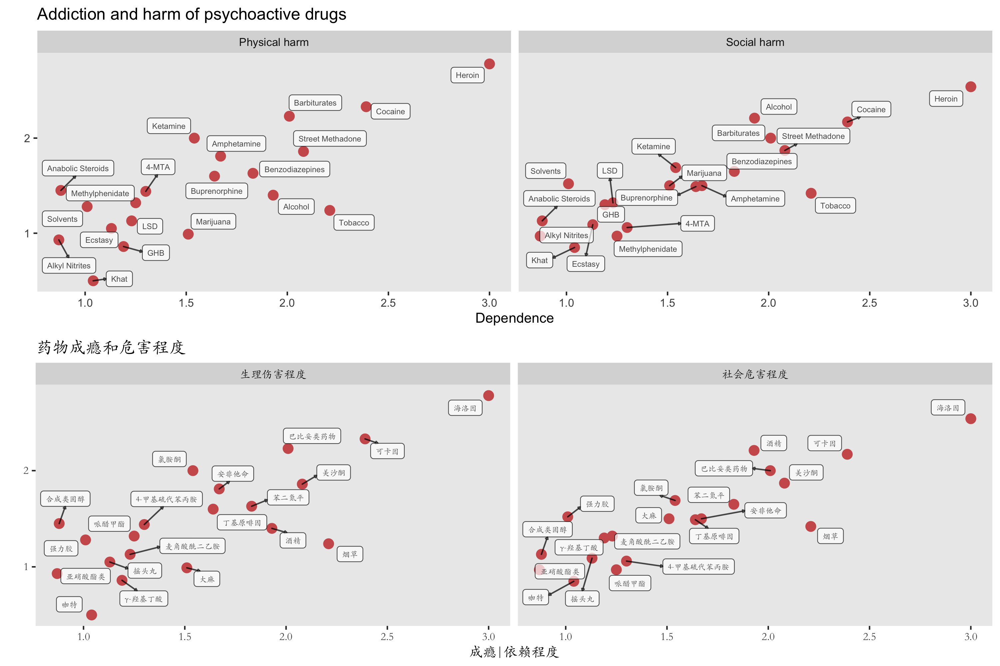
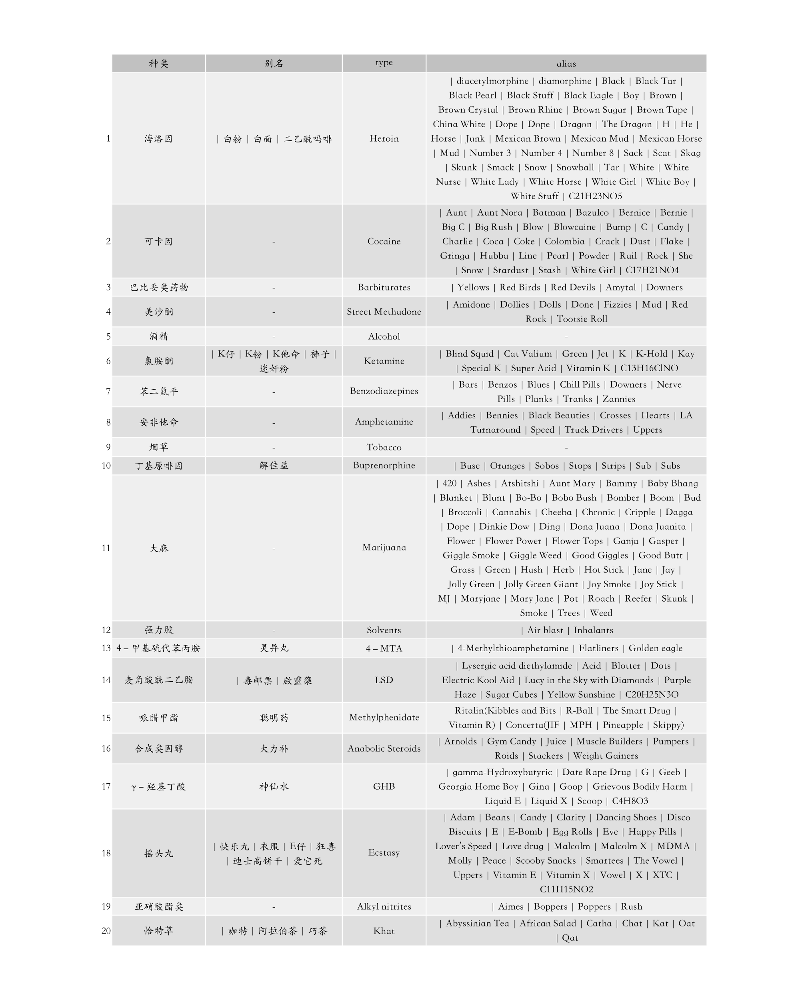

# The Artistic Visualization (AV) Project

<!-- TOC -->

  - [Something Artistic | 随便画画](#something-artistic--%E9%9A%8F%E4%BE%BF%E7%94%BB%E7%94%BB)
    - [Fireworks | 烟火](#fireworks--%E7%83%9F%E7%81%AB)
    - [Strange attractors | 奇异吸引子](#strange-attractors--%E5%A5%87%E5%BC%82%E5%90%B8%E5%BC%95%E5%AD%90)
    - [Colours | 色](#colours--%E8%89%B2)
  - [The Art of Scientific Plotting | 科学作图](#the-art-of-scientific-plotting--%E7%A7%91%E5%AD%A6%E4%BD%9C%E5%9B%BE)
    - [Psychoactive/psychedelic drugs | 成瘾药物 | 毒品](#psychoactivepsychedelic-drugs--%E6%88%90%E7%98%BE%E8%8D%AF%E7%89%A9--%E6%AF%92%E5%93%81)
    - [Survival | 生存曲线](#survival--%E7%94%9F%E5%AD%98%E6%9B%B2%E7%BA%BF)

<!-- /TOC -->

## Something Artistic | 随便画画

### Fireworks | 烟火

* Very naive version... (July 4th, 2019)  
      
  <a href="https://github.com/zhengh42/ArtisticVisualization/blob/master/scripts/R/script_R.md#fireworks" target="\_blank">Script</a>

* Little adjustment  
      

###  Strange attractors | 奇异吸引子

* Clifford attractors  
    
    

### Colours | 色

* Blue and yellow | 蓝与黄  
    
  <a href="input/yellow_blue_berge.txt" target="\_blank">Input</a>

## The Art of Scientific Plotting | 科学作图

### Psychoactive/psychedelic drugs | 成瘾药物 | 毒品

* Addiction and harm of psychoactive drugs | 药物成瘾和危害程度  
  

  Data source: <a href="hhttps://www.thelancet.com/action/showPdf?pii=S0140-6736%2807%2960464-4" target="\_blank">Development of a rational scale to assess the harm of drugs of potential misuse. Lancet. 2007</a>

* Alias for drugs | 毒品别名  
    

### Survival | 生存曲线

* Survival curve of 32 human cancers from TCGA  | TCGA 32种癌症生存曲线  
    
  <a href="output/survival_tcga.pdf" target="\_blank" >Higher resolution in pdf</a>   
  <a href="input/clinical_PANCAN_patient_with_followup.tsv" target="\_blank">Input</a>
