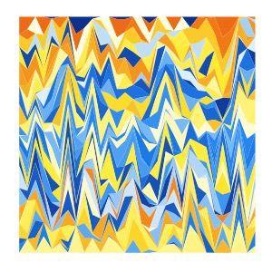

# The Artistic Visualization (AV) Project

## Something Artistic

###  Strange attractors

* Clifford attractors  
    

### Mosaic

* yellow_blue_berge  
    
  Higher resolution in pdf: <a href="output/yellow_blue_berge.pdf">yellow_blue_berge.pdf</a>  
  Input: <a href="input/yellow_blue_berge.txt">link</a>

## The Art of Scientific Plotting

### Survival

* Survival curve of 32 human cancers from TCGA  
    
  Higher resolution in pdf: <a href="output/survival_tcga.pdf">survival_tcga.pdf</a>  
  Input: <a href="input/clinical_PANCAN_patient_with_followup.tsv">link</a>
