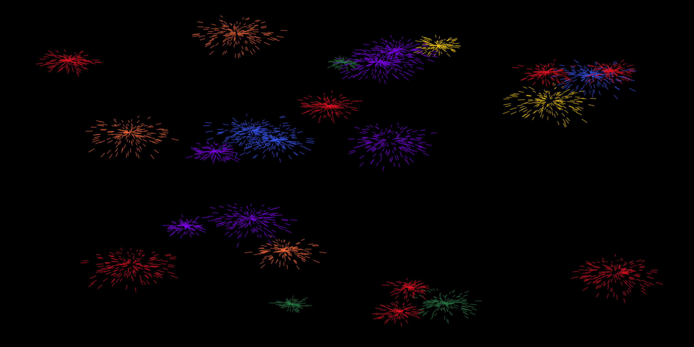
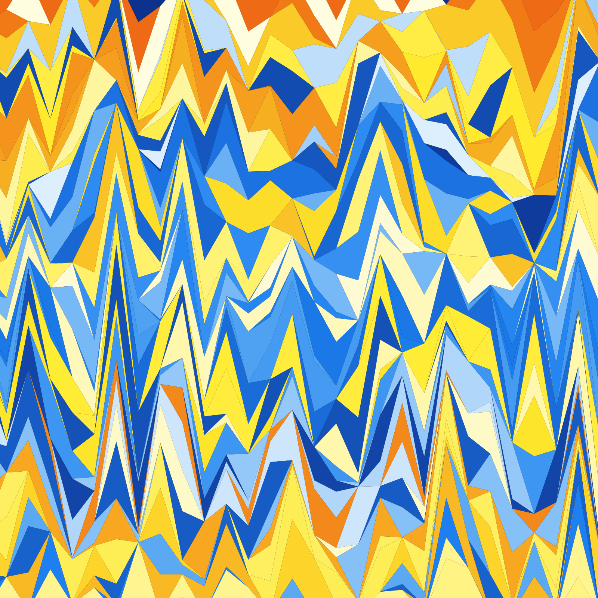
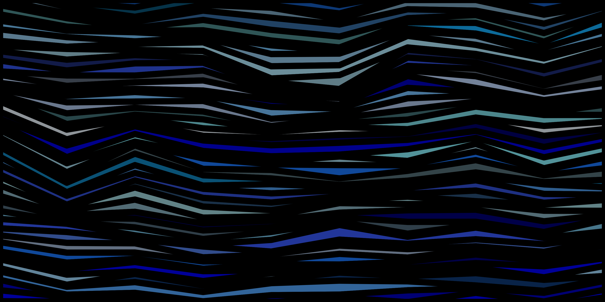
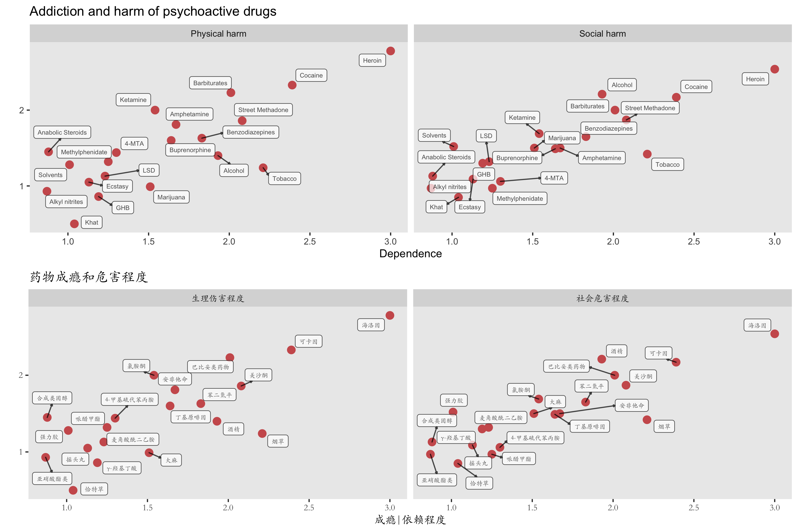

# The Artistic Visualization Project

All plots are made with R, mainly ggplot2.

**_Table of Contents:_**

<!-- TOC -->

  - [Weird](#weird)
    - [DoReMi](#doremi)
  - [Something Artistic | 随便画画](#something-artistic--%E9%9A%8F%E4%BE%BF%E7%94%BB%E7%94%BB)
    - [Moon | 月](#moon--%E6%9C%88)
    - [Sky | 天空](#sky--%E5%A4%A9%E7%A9%BA)
    - [Fireworks | 烟火](#fireworks--%E7%83%9F%E7%81%AB)
    - [Strange attractors | 奇异吸引子](#strange-attractors--%E5%A5%87%E5%BC%82%E5%90%B8%E5%BC%95%E5%AD%90)
    - [Colours | 色](#colours--%E8%89%B2)
  - [The Art of Scientific Plotting | 科学作图](#the-art-of-scientific-plotting--%E7%A7%91%E5%AD%A6%E4%BD%9C%E5%9B%BE)
    - [Tuberculosis in China | 中国肺结核](#tuberculosis-in-china--%E4%B8%AD%E5%9B%BD%E8%82%BA%E7%BB%93%E6%A0%B8)
    - [Psychoactive/psychedelic drugs | 成瘾药物 | 毒品](#psychoactivepsychedelic-drugs--%E6%88%90%E7%98%BE%E8%8D%AF%E7%89%A9--%E6%AF%92%E5%93%81)
    - [Survival | 生存曲线](#survival--%E7%94%9F%E5%AD%98%E6%9B%B2%E7%BA%BF)

<!-- /TOC -->
<!-- /TOC -->

## Weird

### DoReMi

* Avoca\~do\~re\~mi  
    

* Weir\~do\~re\~mi  
    

  [Return to beginning](#the-artistic-visualization-project)  

## Something Artistic | 随便画画

### Moon | 月

* Dawn breeze and fading moon | 晓风残月  
       

  [Return to beginning](#the-artistic-visualization-project)  

###  Sky | 天空

* Sunset or Sunrise | 日落日出  
      
      
      

  [Return to beginning](#the-artistic-visualization-project)  

### Fireworks | 烟火

* Very naive version... (July 4th, 2019)  
      
  <a href="https://github.com/zhengh42/ArtisticVisualization/blob/master/scripts/R/script_R.md#fireworks" target="\_blank">Script</a>

* Little adjustment  
      

  [Return to beginning](#the-artistic-visualization-project)  

###  Strange attractors | 奇异吸引子

* Clifford attractors  
    
    

  [Return to beginning](#the-artistic-visualization-project)  

### Colours | 色

* Minkowski Distance

    

  The Minkowski distance defines the distance between two points in a normed vector space.

  \[
  X=(x_{1},x_{2},...,x_{n})  
  \]
  \[
  Y=(y_{1},y_{2},...,y_{n})  
  \]
  \[
  D(X,Y)=(\sum_{i=1}^n|x_{i}-y_{i}|^p)^\frac{1}{p}
  \]

  When p = 1 or 2, the Minkowski distance corresponds to the Manhattan distance or the Euclidean distance, respectively.

  The plot is a collection of Voronoi diagrams, partitioning the space into sub-spaces based on the distance to a set of pre-defined points/seeds.

  The p for Minkowski distance used in each sub-plot is shown below.

  

  <table>
  <tr>
      <td>
0.1
</td>
      <td>
0.4
</td>
      <td>
0.5
</td>
  </tr>
  <tr>
      <td>
0.7
</td>
      <td>
The points
</td>
      <td>
1 (Manhattan)
</td>
  </tr>
  <tr>
      <td>
1.5</td>
      <td>
2 (Euclidean)
</td>
      <td>
100
</td>
  </tr>
  </table>
  

  [Return to beginning](#the-artistic-visualization-project) 

* Blue and yellow | 蓝与黄   
    
  <a href="input/yellow_blue_berge.txt" target="\_blank">Input</a>

  [Return to beginning](#the-artistic-visualization-project)  

* Voronoi  
      
    

  [Return to beginning](#the-artistic-visualization-project)  

* Fifty shades of | 五十度  
      
    
    
    

## The Art of Scientific Plotting | 科学作图

### Tuberculosis in China | 中国肺结核

* 1990-2017年中国肺结核发病和患病情况  
    
  Data source: Global Burden of Disease Study 2017   
  <a href="https://github.com/zhengh42/ArtisticVisualization/blob/master/input/IHME-GBD_2017_DATA-TB-China.csv" target="\_blank">Input</a>    
  <a href="https://github.com/zhengh42/ArtisticVisualization/blob/master/scripts/R/script_R.md#tuberculosis-burden-in-china" target="\_blank">Script</a>

  [Return to beginning](#the-artistic-visualization-project)  

### Psychoactive/psychedelic drugs | 成瘾药物 | 毒品

* Addiction and harm of psychoactive drugs | 药物成瘾和危害程度  
  

  Data source: <a href="https://www.thelancet.com/action/showPdf?pii=S0140-6736%2807%2960464-4" target="\_blank">Development of a rational scale to assess the harm of drugs of potential misuse. Lancet. 2007</a>

* Alias for drugs | 毒品别名  
    

  [Return to beginning](#the-artistic-visualization-project)  

### Survival | 生存曲线

* Survival curve of 32 human cancers from TCGA  | TCGA 32种癌症生存曲线  
    
  <a href="output/survival_tcga.pdf" target="\_blank" >Higher resolution in pdf</a>   
  <a href="input/clinical_PANCAN_patient_with_followup.tsv" target="\_blank">Input</a>

  [Return to beginning](#the-artistic-visualization-project)  
